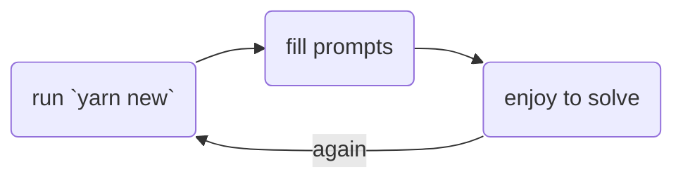

# EXPERIMENTS

## CONTENTS

-   [LeetCode](/solutions/leetcode/)
<!-- NEW_SOLUTION_ITEMS -->

## GAME FLOW

1. run `yarn new` or `npm run new` or `pnpm run new`
2. fill prompts
3. enjoy to solve :)

## LICENSE

Uder [MIT LICENSE](./LICENSE.md)
